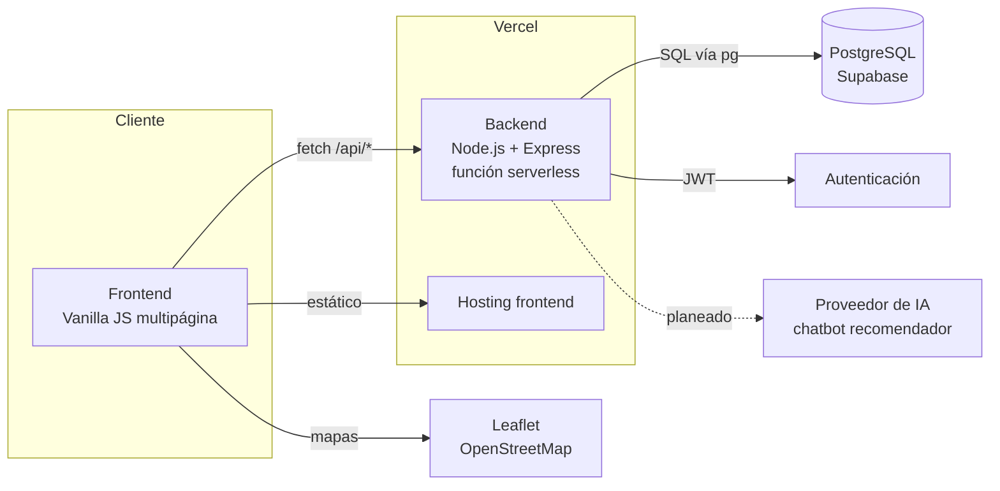
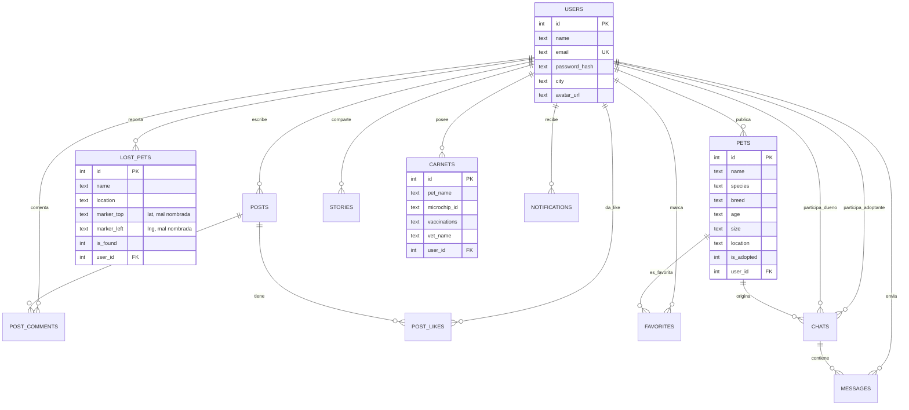

# 2.7 — Diagramas del Sistema

> Requisito oficial (mínimo): Diagrama de Casos de Uso · Diagrama de Clases ·
> Diagrama de Secuencia (al menos 2) · Diagrama de Arquitectura (alto nivel) ·
> Diagrama Entidad-Relación (Base de Datos)

⚠️ Los bloques en Mermaid de abajo son un **borrador funcional**, sacado directo del
esquema real del código (`backend/db/database.js` y `backend/server.js`). Sirven para
no arrancar de cero, pero para el PDF final hay que exportarlos como imagen (Mermaid no
se pega en Word) — se puede usar el editor online de mermaid.live o una extensión de
VSCode.

## 7.1 Diagrama de Casos de Uso

**Falta.** El PDF "Alcance de MVP" tiene algo en la página 2 pero está insertado como
imagen y no se pudo verificar si está completo. Confirmar que cubra como mínimo:
publicar mascota, adoptar, reportar pérdida, ver mapa, marcar como encontrada, y sumar
el caso de uso del asistente de IA cuando esté implementado.

## 7.2 Diagrama de Clases

**Falta.** El sistema no está modelado en clases (es Express con funciones), así que el
diagrama de clases debe representar las **entidades de dominio**, no el código literal.
Punto de partida a partir del modelo de datos real:

```
Usuario ── publica ──> Mascota ── genera ──> Chat ── contiene ──> Mensaje
Usuario ── reporta ──> MascotaPerdida
Usuario ── escribe ──> Post ── recibe ──> Comentario, Like
Usuario ── comparte ──> HistoriaDeExito
Usuario ── posee ──> Carnet (de una mascota)
Usuario ── recibe ──> Notificación
```

Convertir esto en un diagrama de clases UML formal (atributos + métodos) para el
documento final.

## 7.3 Diagramas de Secuencia (mínimo 2)

**Faltan.** Sugeridos por la propia Hoja de Ruta: "solicitud de adopción" y "registro de
usuario". Con el flujo real ya implementado, agregar también "reportar mascota perdida"
tiene sentido porque muestra bien el punto débil (falta el paso de notificación por
cercanía).

## 7.4 Diagrama de Arquitectura (alto nivel)

Borrador basado en la infraestructura real:



## 7.5 Diagrama Entidad-Relación (Base de Datos)

Sacado 1 a 1 del esquema real (`backend/db/database.js`, 12 tablas):



**Nota para el manual técnico:** las columnas `marker_top`/`marker_left` de
`lost_pets` guardan latitud/longitud reales como texto, pero el nombre viene de un
diseño anterior (posicionar un pin en % sobre una imagen). Si van a construir las
alertas por radio de distancia, conviene primero renombrarlas/tiparlas como
`lat NUMERIC` / `lng NUMERIC` — hoy son `TEXT`.
