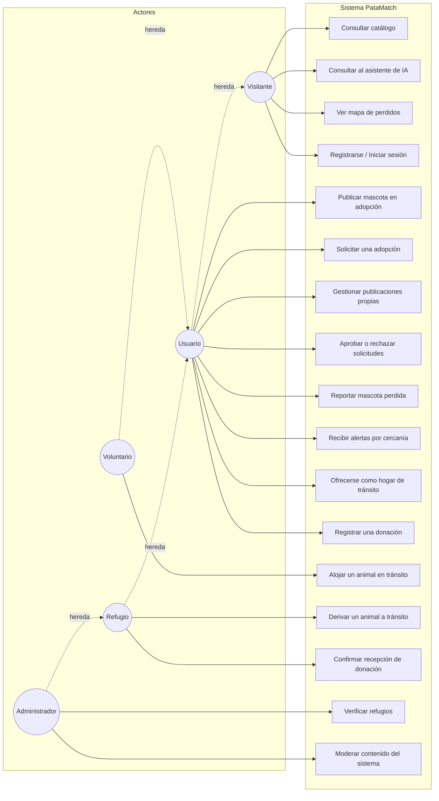
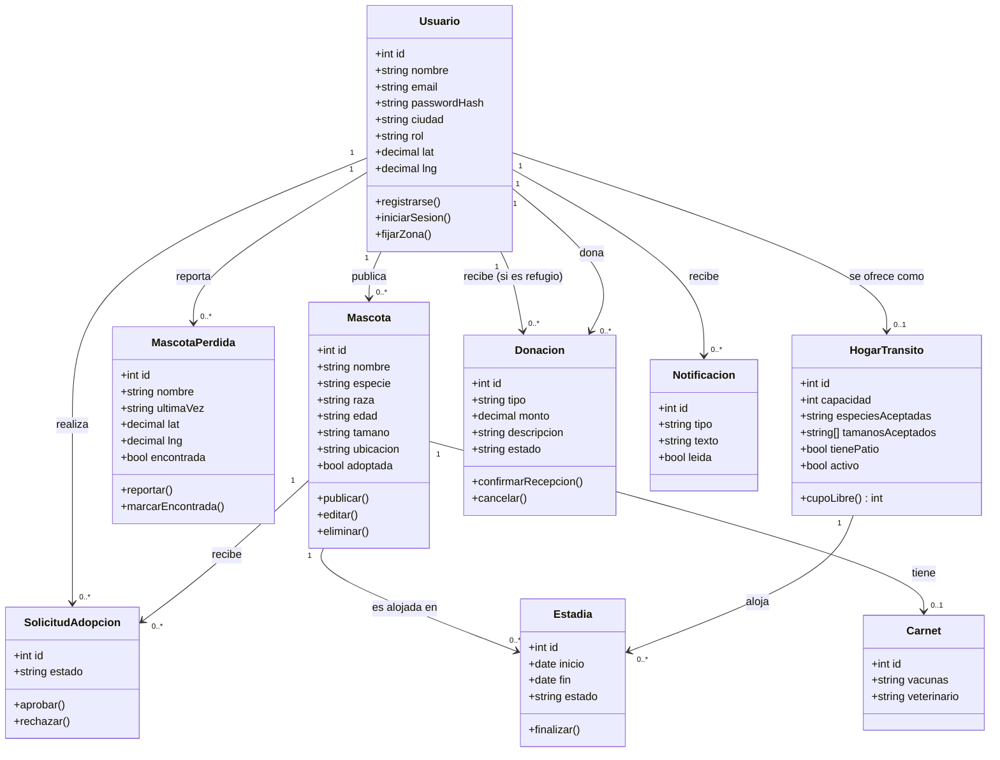
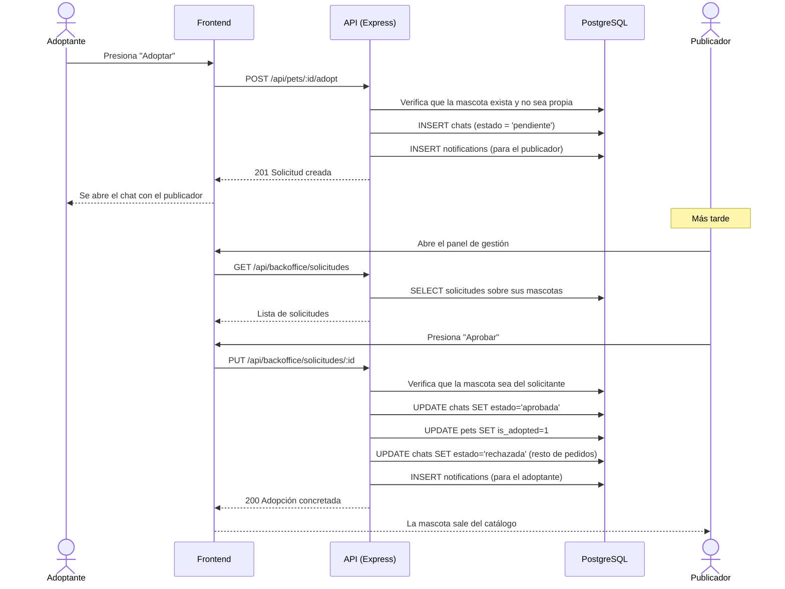
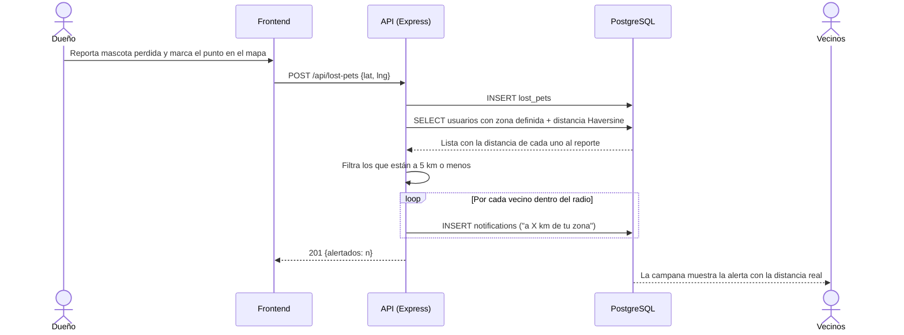
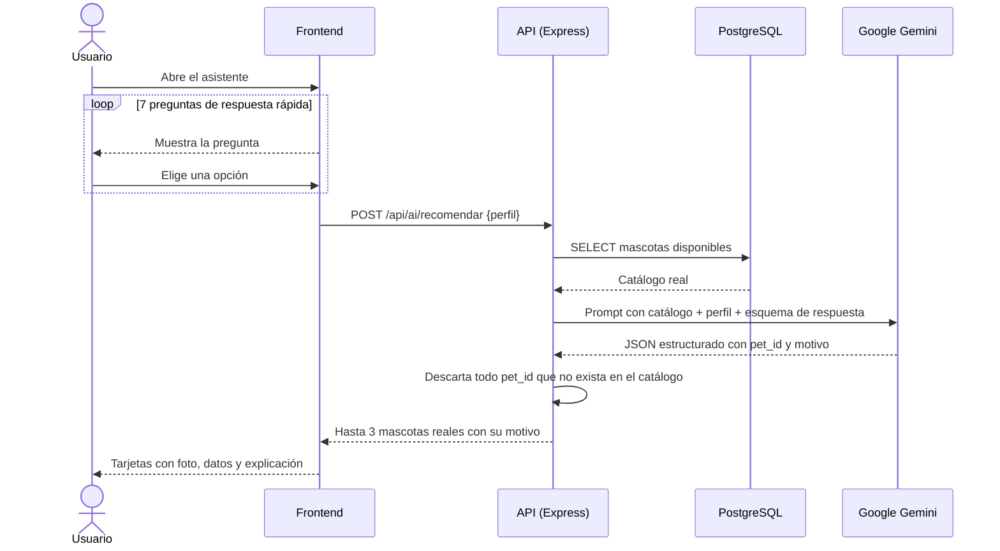
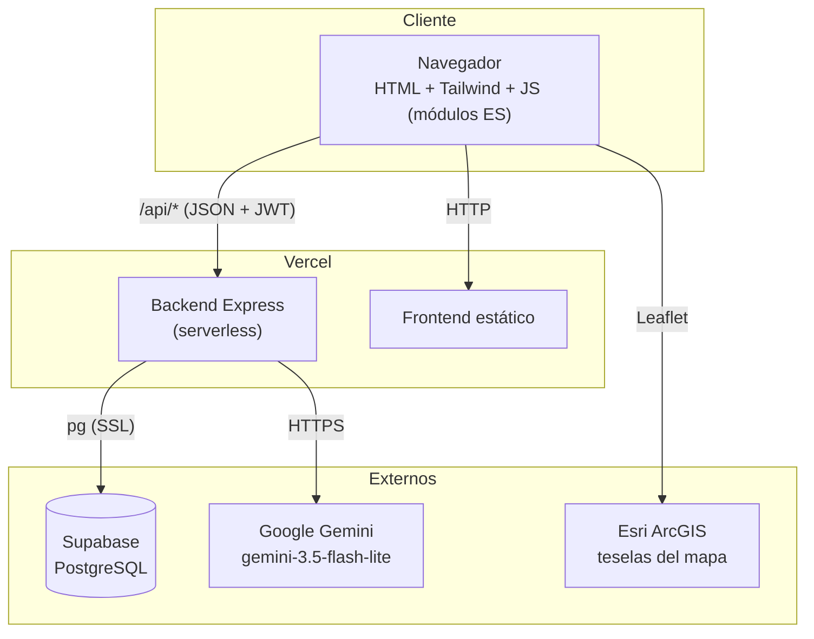
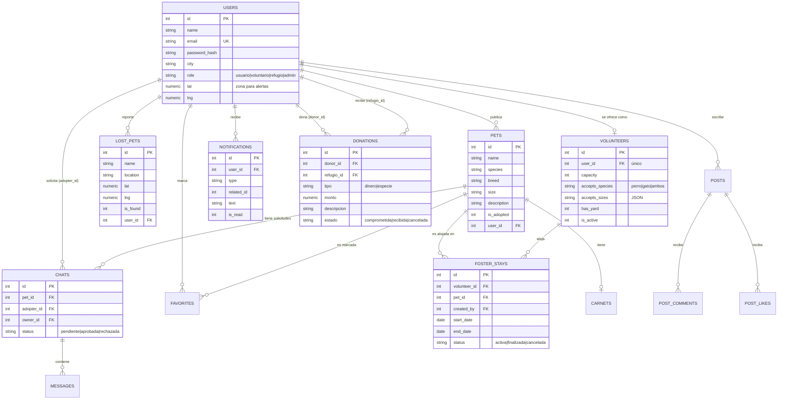

# 2.7 — Diagramas del Sistema

> Requisito oficial: Diagrama de Casos de Uso · Diagrama de Clases · Diagramas de
> Secuencia (mínimo 2) · Diagrama de Arquitectura · Diagrama Entidad-Relación.

**Nota para el armado del documento final:** los diagramas están escritos en Mermaid, que
no se renderiza dentro de Word. Antes de armar el PDF hay que exportar cada uno como
imagen (PNG o SVG) desde [mermaid.live](https://mermaid.live) y pegar la imagen.

---

## 7.1 Diagrama de Casos de Uso

Cuatro actores. El administrador hereda todo lo del usuario y suma la moderación; el
refugio es un usuario verificado que además recibe donaciones y coordina tránsitos.

```mermaid
flowchart LR
    subgraph Actores
        V((Visitante))
        U((Usuario))
        VOL((Voluntario))
        REF((Refugio))
        ADM((Administrador))
    end

    subgraph Sistema PataMatch
        CU01[Consultar catálogo]
        CU02[Consultar al asistente de IA]
        CU03[Ver mapa de perdidos]
        CU04[Registrarse / Iniciar sesión]
        CU05[Publicar mascota en adopción]
        CU06[Solicitar una adopción]
        CU07[Gestionar publicaciones propias]
        CU08[Aprobar o rechazar solicitudes]
        CU09[Reportar mascota perdida]
        CU10[Recibir alertas por cercanía]
        CU11[Ofrecerse como hogar de tránsito]
        CU12[Registrar una donación]
        CU13[Alojar un animal en tránsito]
        CU14[Derivar un animal a tránsito]
        CU15[Confirmar recepción de donación]
        CU16[Verificar refugios]
        CU17[Moderar contenido del sistema]
    end

    V --> CU01
    V --> CU02
    V --> CU03
    V --> CU04

    U --> CU05
    U --> CU06
    U --> CU07
    U --> CU08
    U --> CU09
    U --> CU10
    U --> CU11
    U --> CU12

    VOL --> CU13
    REF --> CU14
    REF --> CU15
    ADM --> CU16
    ADM --> CU17

    U -.hereda.-> V
    VOL -.hereda.-> U
    REF -.hereda.-> U
    ADM -.hereda.-> REF
```

**Aclaración de diseño:** publicar una mascota y gestionar sus solicitudes son casos de uso
del **usuario común**, no exclusivos del refugio. En PataMatch cualquier persona puede dar
un animal en adopción, así que cualquiera necesita poder responder a quien se lo pide. El
rol de refugio agrega capacidades (recibir donaciones, coordinar hogares de tránsito), no
habilita las básicas.

---

## 7.2 Diagrama de Clases

El backend es Express con módulos de funciones, no clases. Para el documento se modelan
las **entidades del dominio** y sus relaciones, que es lo que el diagrama de clases debe
comunicar.

```mermaid
classDiagram
    class Usuario {
        +int id
        +string nombre
        +string email
        +string passwordHash
        +string ciudad
        +string rol
        +decimal lat
        +decimal lng
        +registrarse()
        +iniciarSesion()
        +fijarZona()
    }

    class Mascota {
        +int id
        +string nombre
        +string especie
        +string raza
        +string edad
        +string tamano
        +string ubicacion
        +bool adoptada
        +publicar()
        +editar()
        +eliminar()
    }

    class MascotaPerdida {
        +int id
        +string nombre
        +string ultimaVez
        +decimal lat
        +decimal lng
        +bool encontrada
        +reportar()
        +marcarEncontrada()
    }

    class SolicitudAdopcion {
        +int id
        +string estado
        +aprobar()
        +rechazar()
    }

    class HogarTransito {
        +int id
        +int capacidad
        +string especiesAceptadas
        +string[] tamanosAceptados
        +bool tienePatio
        +bool activo
        +cupoLibre() int
    }

    class Estadia {
        +int id
        +date inicio
        +date fin
        +string estado
        +finalizar()
    }

    class Donacion {
        +int id
        +string tipo
        +decimal monto
        +string descripcion
        +string estado
        +confirmarRecepcion()
        +cancelar()
    }

    class Notificacion {
        +int id
        +string tipo
        +string texto
        +bool leida
    }

    class Carnet {
        +int id
        +string vacunas
        +string veterinario
    }

    Usuario "1" --> "0..*" Mascota : publica
    Usuario "1" --> "0..*" MascotaPerdida : reporta
    Usuario "1" --> "0..1" HogarTransito : se ofrece como
    Usuario "1" --> "0..*" Notificacion : recibe
    Usuario "1" --> "0..*" Donacion : dona
    Usuario "1" --> "0..*" Donacion : recibe (si es refugio)
    Mascota "1" --> "0..*" SolicitudAdopcion : recibe
    Usuario "1" --> "0..*" SolicitudAdopcion : realiza
    HogarTransito "1" --> "0..*" Estadia : aloja
    Mascota "1" --> "0..*" Estadia : es alojada en
    Mascota "1" --> "0..1" Carnet : tiene
```

---

## 7.3 Diagramas de Secuencia

### 7.3.1 — Solicitud de adopción, de punta a punta

```mermaid
sequenceDiagram
    actor A as Adoptante
    participant F as Frontend
    participant API as API (Express)
    participant BD as PostgreSQL
    actor P as Publicador

    A->>F: Presiona "Adoptar"
    F->>API: POST /api/pets/:id/adopt
    API->>BD: Verifica que la mascota exista y no sea propia
    API->>BD: INSERT chats (estado = 'pendiente')
    API->>BD: INSERT notifications (para el publicador)
    API-->>F: 201 Solicitud creada
    F-->>A: Se abre el chat con el publicador

    Note over P: Más tarde
    P->>F: Abre el panel de gestión
    F->>API: GET /api/backoffice/solicitudes
    API->>BD: SELECT solicitudes sobre sus mascotas
    API-->>F: Lista de solicitudes
    P->>F: Presiona "Aprobar"
    F->>API: PUT /api/backoffice/solicitudes/:id
    API->>BD: Verifica que la mascota sea del solicitante
    API->>BD: UPDATE chats SET estado='aprobada'
    API->>BD: UPDATE pets SET is_adopted=1
    API->>BD: UPDATE chats SET estado='rechazada' (resto de pedidos)
    API->>BD: INSERT notifications (para el adoptante)
    API-->>F: 200 Adopción concretada
    F-->>P: La mascota sale del catálogo
```

### 7.3.2 — Alerta automática por cercanía (RF-11)

Es el diferencial del proyecto: convierte un reporte en un aviso dirigido.

```mermaid
sequenceDiagram
    actor D as Dueño
    participant F as Frontend
    participant API as API (Express)
    participant BD as PostgreSQL
    actor V as Vecinos

    D->>F: Reporta mascota perdida y marca el punto en el mapa
    F->>API: POST /api/lost-pets {lat, lng}
    API->>BD: INSERT lost_pets
    API->>BD: SELECT usuarios con zona definida + distancia Haversine
    BD-->>API: Lista con la distancia de cada uno al reporte
    API->>API: Filtra los que están a 5 km o menos
    loop Por cada vecino dentro del radio
        API->>BD: INSERT notifications ("a X km de tu zona")
    end
    API-->>F: 201 {alertados: n}
    BD-->>V: La campana muestra la alerta con la distancia real
```

### 7.3.3 — Recomendación del asistente de IA (RF-25)

```mermaid
sequenceDiagram
    actor U as Usuario
    participant F as Frontend
    participant API as API (Express)
    participant BD as PostgreSQL
    participant G as Google Gemini

    U->>F: Abre el asistente
    loop 7 preguntas de respuesta rápida
        F-->>U: Muestra la pregunta
        U->>F: Elige una opción
    end
    F->>API: POST /api/ai/recomendar {perfil}
    API->>BD: SELECT mascotas disponibles
    BD-->>API: Catálogo real
    API->>G: Prompt con catálogo + perfil + esquema de respuesta
    G-->>API: JSON estructurado con pet_id y motivo
    API->>API: Descarta todo pet_id que no exista en el catálogo
    API-->>F: Hasta 3 mascotas reales con su motivo
    F-->>U: Tarjetas con foto, datos y explicación
```

---

## 7.4 Diagrama de Arquitectura

```mermaid
flowchart TB
    subgraph Cliente
        NAV["Navegador<br/>HTML + Tailwind + JS (módulos ES)"]
    end

    subgraph Vercel
        EXP["Backend Express<br/>(serverless)"]
        EST["Frontend estático"]
    end

    subgraph Externos
        SUP[("Supabase<br/>PostgreSQL")]
        GEM["Google Gemini<br/>gemini-3.5-flash-lite"]
        ESRI["Esri ArcGIS<br/>teselas del mapa"]
    end

    NAV -->|HTTP| EST
    NAV -->|"/api/* (JSON + JWT)"| EXP
    EXP -->|"pg (SSL)"| SUP
    EXP -->|"HTTPS"| GEM
    NAV -->|"Leaflet"| ESRI
```

**Decisiones justificadas:**

- **Supabase (PostgreSQL gestionado)** en lugar de una base local: Vercel ejecuta funciones
  serverless sin disco persistente, por lo que una base embebida no sobreviviría entre
  invocaciones. Se necesita una base externa.
- **Esri en lugar de CARTO** para las teselas del mapa: el servicio gratuito de CARTO pasó
  a exigir clave de API. Esri ofrece un estilo equivalente sin registro.
- **Modelo *lite* de Gemini**: elegido tras medir (~1,3 s contra ~15 s del modelo completo,
  con recomendaciones equivalentes).

---

## 7.5 Diagrama Entidad-Relación

```mermaid
erDiagram
    USERS ||--o{ PETS : publica
    USERS ||--o{ LOST_PETS : reporta
    USERS ||--o| VOLUNTEERS : "se ofrece como"
    USERS ||--o{ CHATS : "solicita (adopter_id)"
    USERS ||--o{ NOTIFICATIONS : recibe
    USERS ||--o{ DONATIONS : "dona (donor_id)"
    USERS ||--o{ DONATIONS : "recibe (refugio_id)"
    USERS ||--o{ POSTS : escribe
    USERS ||--o{ FAVORITES : marca

    PETS ||--o{ CHATS : "tiene solicitudes"
    PETS ||--o{ FOSTER_STAYS : "es alojada en"
    PETS ||--o| CARNETS : tiene
    PETS ||--o{ FAVORITES : "es marcada"

    VOLUNTEERS ||--o{ FOSTER_STAYS : aloja
    CHATS ||--o{ MESSAGES : contiene
    POSTS ||--o{ POST_COMMENTS : recibe
    POSTS ||--o{ POST_LIKES : recibe

    USERS {
        int id PK
        string name
        string email UK
        string password_hash
        string city
        string role "usuario|voluntario|refugio|admin"
        numeric lat "zona para alertas"
        numeric lng
    }

    PETS {
        int id PK
        string name
        string species
        string breed
        string size
        string description
        int is_adopted
        int user_id FK
    }

    LOST_PETS {
        int id PK
        string name
        string location
        numeric lat
        numeric lng
        int is_found
        int user_id FK
    }

    CHATS {
        int id PK
        int pet_id FK
        int adopter_id FK
        int owner_id FK
        string status "pendiente|aprobada|rechazada"
    }

    VOLUNTEERS {
        int id PK
        int user_id FK "único"
        int capacity
        string accepts_species "perro|gato|ambos"
        string accepts_sizes "JSON"
        int has_yard
        int is_active
    }

    FOSTER_STAYS {
        int id PK
        int volunteer_id FK
        int pet_id FK
        int created_by FK
        date start_date
        date end_date
        string status "activa|finalizada|cancelada"
    }

    DONATIONS {
        int id PK
        int donor_id FK
        int refugio_id FK
        string tipo "dinero|especie"
        numeric monto
        string descripcion
        string estado "comprometida|recibida|cancelada"
    }

    NOTIFICATIONS {
        int id PK
        int user_id FK
        string type
        int related_id
        string text
        int is_read
    }
```

**Nota técnica sobre `lost_pets`:** las columnas `marker_top` y `marker_left` guardan
latitud y longitud como texto; el nombre viene de un diseño anterior en el que se
posicionaba un pin en porcentaje sobre una imagen. Al implementar las alertas por radio se
agregaron `lat` y `lng` como columnas numéricas reales y se migraron los datos existentes.
Las columnas antiguas se conservan por compatibilidad y pueden eliminarse en una limpieza
posterior.

**Nota sobre el cupo de los hogares de tránsito:** el cupo libre **no** se almacena. Se
calcula siempre como `capacity` menos la cantidad de estadías activas, para que no pueda
quedar desincronizado con la realidad.
